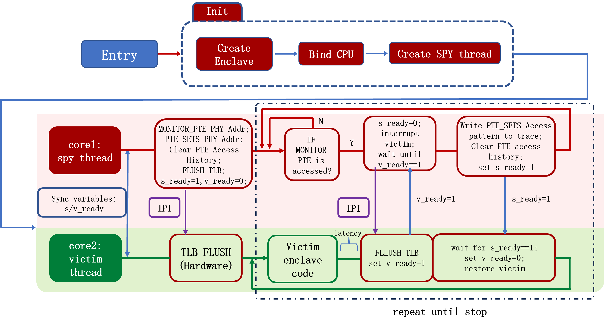
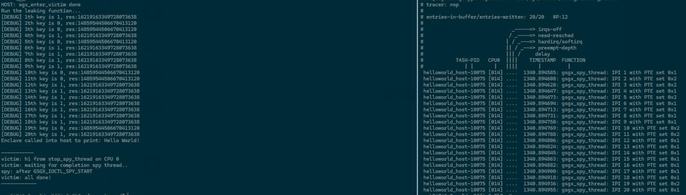

# SGX-PTE-MOD

This is a migration for the page table entry based side-channel attack proposed in the paper "Telling Your Secrets Without Page Faults: Stealthy Page Table-Based Attacks on Enclaved Execution", which appears in 2017 but still works for now (2024). 

You can find the attack code from the original authors of the paper [here](https://github.com/jovanbulck/sgx-pte). It was implemented within the [Graphene-SGX framework](https://github.com/gramineproject/graphene), which I found to be out of maintenance and hard to adapt. Therefore, I rewrote the sgx-pte attack as a separate linux kernel module for extensibility and ease of use.

## How it works?

I'm too lazy to repeat the details in the paper, but this chart should help.



## Usage

Basic steps:
1. Get the virtual address of the MONITOR_PTE in the victim enclave, which works as a "trigger": whenever the page including this address is accessed, we interrupt the victim Enclave and check if the page in PTE_SETS has been accessed.
2. Get the virtual addresses of the PTE_SETS: pages that you want to snoop on access patterns.
3. Put these addresses accordingly to `MONITOR_ADRS` and the args of `add_to_pte_set` in the `pte_utils.c` and make&install the pte_spy_mod.ko. (I know it's kind of silly, but I'm too lazy to improve on this. It's enough for aCaDemIcs, isn't it?)
4. Build the user mode library `libsgx_pte_attack.so`.
5. Manage to inject the lib into the untrusted part (outside of enclave) of the victim process and call the `sgx_enter_victim` function to start the attack.

Notice that in SGX's threat model, an attacker can be assumed to have OS privileges, so all of the above steps is theoretically not hard to achieve (turning off ASLR, hacking the kernel page allocation mechanism and program loader, etc). Anyway, I provide a PoC that can be run directly `./run.sh`, or manully:

```shell
echo 0 | sudo tee /proc/sys/kernel/randomize_va_space
echo 0 | sudo tee /proc/sys/kernel/kptr_restrict
echo off | sudo tee /sys/devices/system/cpu/smt/control 
source /opt/openenclave/share/openenclave/openenclaverc
cd ~/sgx-pte-mod/spy-kernel/
make clean
make remake
cd ~/sgx-pte-mod/spy-user/helloworld/
make clean
make
make run
```

After that, check the trace in `/sys/kernel/debug/tracing/trace` to find the leaked page access pattern. Example output:



>Only the A/D bit detection method is tested, since the FLUSH+FLUSH method seems to be very unstable on my machine.
